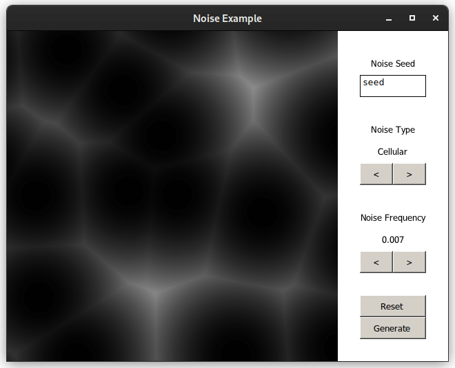

#  Noise Object

Noise object is Clickteam Fusion extension that allows you to use most of [FastNoiseLite](https://github.com/Auburn/FastNoiseLite) library funtionality in Clickteam Fusion and add some fancy noise stuff.


## Screenshot



(Noise Example.mfa running on linux through proton ge)


## Examples

There are some [included examples](Examples/Noise/), you can also find them in your Clickteam Fusion 2.5/Examples/Noise/ folder after you installed Noise.


## Wiki / Help file

I recently finaly created Noise Object wiki on github. Wiki is also automaticaly converted to help file that you can read offline, you can handy link to it in about page inside object properties.
Note: currently this wiki/help file is very much work in progress, not everythings is documented yet.


## Installing

To install Noise Object, just download [latest release](https://github.com/kapigames/NoiseExtension/releases/latest), unzip it and copy all files to correct directories in your Fusion install (Often: "C:\Program Files (x86)\Steam\steamapps\common\Clickteam Fusion 2.5\"). Also this extension uses dark edif update checker, this means you will receive notifications about updates in Fusion. Updating extension is the same as installing it, just override old files.


## Building

To build Noise Object yourself you need Visual Studio 2022 with C/C++ toolkit and Android toolkit, if you want to compile for Android.

You can open Noise.sln solution in Visual Studio and compile it from VS or if you don't like VS like me, use build.bat script.

Using this command will build entire Noise Object and install it onto your Fusion install (by default "C:\Program Files (x86)\Steam\steamapps\common\Clickteam Fusion 2.5\" change it inside build.bat script, if you need, don't commit that change of course.)
```cmd
build.bat --install
```

Other build.bat flags:

- `--fast` Build only Windows Edittime and Runtime.
- `--debug` Build using debug configuration.
- `--clean` Clean the build directory before building.
- `--bundle` Bundle Noise Object, help file and examples into single zip file.
- `--sdkconfig` Create "FusionSDKConfig.ini" file with default settings inside, in parent directory.